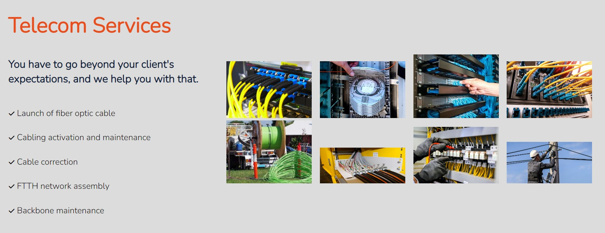

<h1>JGA TELECOM</h1>

<h2>Features</h2>

<h3>Existing Features</h3>
<ul>
<li>Navigation Bar</li>

It presents the 4 pages of navigation through the website, all are responsive.

<li>Request information button</li>

Responsive button to request information.

Our navigation bar has a hidden screen with a return message to the company's request for information, guaranteeing the customer that the company will receive it.

<li>Footer</li>

In the footer there are navigation buttons for the pages and also for returning to the top.

A link to subscribe to the company's channel, with the benefit of receiving Internet tips, news from the fiber optic market and a catalog of services from our partners by email.

It has access buttons to all the company's social media.

the subscribe button also has a hidden thank you screen

</ul>

<li>Clients page</li>

It has a list of the company's customers and partners.

All have their logo and responsive link that leads to the company's website.

<li>Serviscs page</li>

List of services provided by JGA Telecom.

Images to demonstrate the quality of service provided to customers.

<li>Contact page</li>

Responsive form, with return message.

