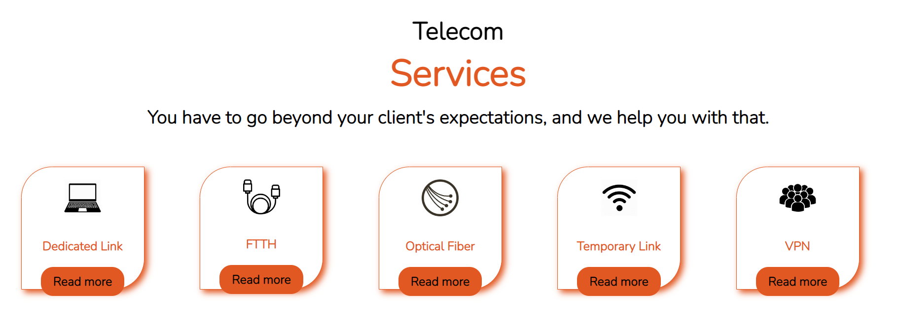
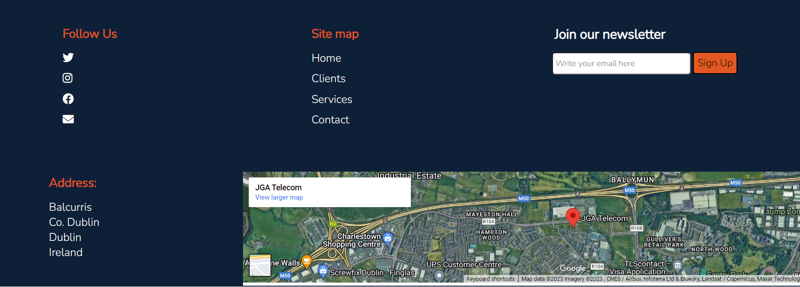
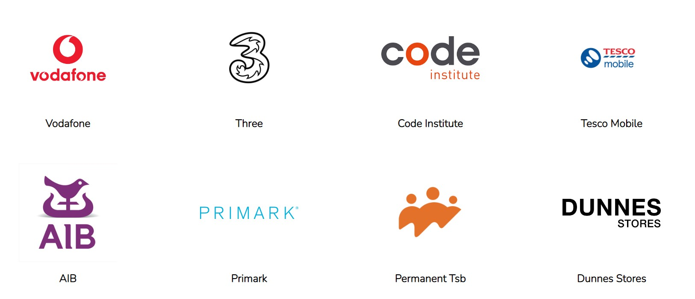
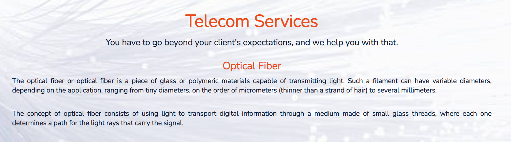
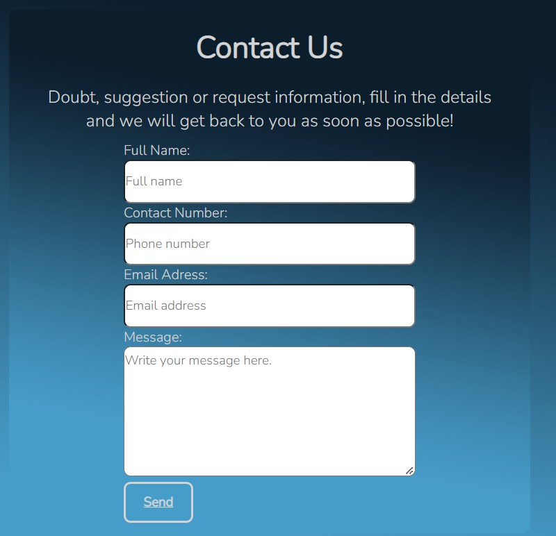
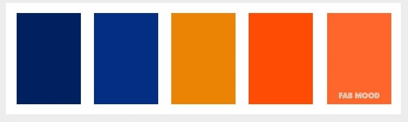
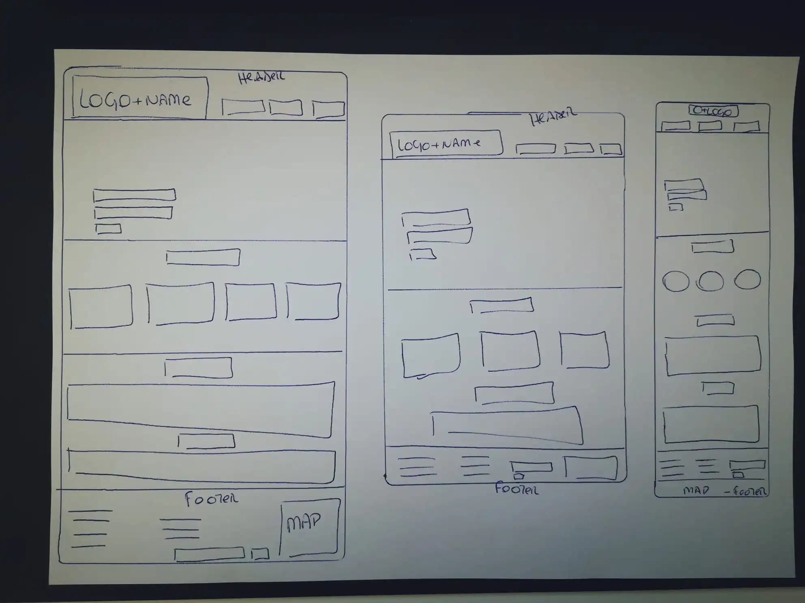
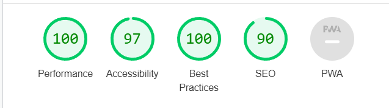

<h1>JGA TELECOM</h1>

JGA Telecom is a small, family-owned company that was designed and created shortly after the start of social isolation due to the pandemic (2020), having as a relevant factor the high growth in search of fast and quality internet, the lack of jobs and the high experience of the people involved in this project.

We offer complete support in maintenance and installation of fiber optic cabling. Certainly, Optical Fiber is the most suitable technology to supply the large volume of information that travels daily through networks. And to increase the speed of transmission of digital information, the replacement of metallic cables by optical cables is essential, not to say inevitable.

The Telecom sector is an example that innovation is necessary, as changes happen increasingly quickly and profoundly.

Visit our page by clicking here:
<a href="https://elisabetebilini.github.io/portfolio01/"  target="_blank" rel=”noopener”> JGA Telecom</a>

 

<h2>Features</h2>
<h3>Existing Features</h3>
    <ul>
        <li>Navigation Bar</li>
    <ul>
        <li>It presents the 4 pages of navigation through the website, all are responsive.</li>
    </ul>
    </ul>
     

<ul>
 <li>Landing Page</li>
    <ul>
    <li>It has a demonstration of services provided by JGA Telecom, when clicking on each card customers are directed to the services page where a brief description of each item is described.</li>
    <li>We have an about us section to learn about our company, mission, vision and values.</li>
    </ul>
</ul>
 

<ul>
<li>Footer</li>
    <ul>
    <li>In the footer there are navigation buttons for the pages and also for returning to the top.</li>
    <li>A link to subscribe to the company's channel, with the benefit of receiving Internet tips, news from the fiber optic market and a catalog of services from our partners by email.</li>
    <li>It has access buttons to all the company's social media.</li>
    </ul>
</ul>

 <ul>
 <li>Clients Page</li>
    <ul>
    <li>It has a list of the company's customers and partners.</li>
    <li>All have their logo and responsive link that leads to the company's website.</li>
    <li><strong>The use of the brands is for educational purposes only, no contract is binding between the company and this website.</strong></li>
    </ul>
</ul>

<ul>
 <li>Services Page</li>
    <ul>
    <li>List of services provided by JGA Telecom.</li>
    <li>At the end of the services section on this page, there are some images to demonstrate the quality of service provided to customers.</li>
    </ul>
</ul>

<ul>
 <li>Contact-Us Page</li>
    <ul>
    <li>Responsive form, with return message.</li>
    </ul>
</ul>

<h2>Design</h2>
<ul>
 <li>Colours</li>
    <ul>
    <li>To define the color palette, I opted for contrasting ones and also used color psychology: orange is defined as an energetic and vibrant color, while blue is associated with reliability, competence, quality.</li>
    </ul>
</ul>

<ul>
 <li>Fonts</li>
    <ul>
    <li><a href="https://fonts.google.com/"  target="_blank" rel=”noopener”> Google Fonts</a></li>
    </ul>
</ul>
<ul>
 <li>Wireframe</li>
 <ul>
 <li>Decided to keep the design clean with good images.</li>
 </ul>

</ul>

<h2>Features left to implement</h2><ul>
<li>Implement a system for sending emails with data capture for the thank you page, not using the Code Institute sending system.</li>
<li>Improve responsiveness of all pages and implement responsiveness for screens below 360px.</li>
</ul>

<h2>Technologies Used</h2>
<ul>
 <li>HTML</li>
    <ul>
    <li>Used to give structure to website.</li>
    </ul>
</ul>

<ul>
 <li>CSS</li>
    <ul>
    <li>Used to style the structure created for the website.</li>
    </ul>
</ul>

<ul>
    <li><a href="https://gitpod.io/"  target="_blank" rel=”noopener”> GitPod</a></li>
    <ul>
    <li>Open source platform used for code development.</li>
    </ul>
</ul>

<ul>
    <li><a href="https://github.com/"  target="_blank" rel=”noopener”> GitHub</a></li>
    <ul>
    <li>Internet hosting service platform, used to host the website address and all its content.</li>
    </ul>
</ul>

<ul>
 <li>Google Developer Tools</li>
    <ul>
    <li>Used for verification and adjustments relevant to the project.</li>
    </ul>
</ul>

<h2>Testing</h2>
<ul>
    <li><a href="https://validator.w3.org/"  target="_blank" rel=”noopener”> W3C Markup Validator</a></li>
    <ul>
    <li>No errors returned</li>
    </ul>
        <li><a href="https://jigsaw.w3.org/css-validator/"  target="_blank" rel=”noopener”> W3C CSS Validator (Jigsaw)</a></li>
      <ul>
    <li>No errors returned</li>
    </ul>
        <li><a href="https://wave.webaim.org/"  target="_blank" rel=”noopener”> Wave</a></li>
        <li>Lighthouse (Chrome Developer Tools)</a></li>
     

<h2>Bugs and fixes</h2>
    <li>During validation tests my site was experiencing performance issues related to the image of all customer and service pages, in all media sizes.</li>
    <ul>
    <li>I solved the problem changing the image format from jpg/png to webp.</li>
    </ul>
    
<h2>Deployment</h2>
<h3>GitHub</h3>

<h4></h4>
<ol>
<li>In the GitHub body of my page, click the menu button: repository;</li>
<li>Locate the portfolio01 project and click;</li>
<li>Click on the button: settings;</li>
<li>Click on the button: pages;</li>
<li>Click on the button: visit the site.</li>

</ol>
<h4>Cloning the GitHub Repository</h4>
<ol>
<li>On GitHub.com, navigate to the main page of the repository.</li>
<li>To clone your repository using the command line using HTTPS, under "Quick setup", click in copying.  To clone the repository using an SSH key, including a certificate issued by your organization's SSH certificate authority, click SSH, then click in copying.</li>
<li>Open Git Bash.</li>
<li>Change the current working directory to the location where you want the cloned directory.</li>
<li>Type git clone, and then paste the URL you copied earlier.</li>
<li>Press Enter to create your local clone.</li>
</ol>

<h2>Credits</h2>
<ul>
    <li><a href="https://css-tricks.com/"  target="_blank" rel=”noopener”> css-tricks</a></li>
<ul>
    <li>Used to help in learning and defining Flex-box and Grid.</li>
    </ul>
</ul>

<ul>
 <li><a href="https://slack.com/intl/en-ie/"  target="_blank" rel=”noopener”> Slack</a></li>
    <ul>
        <li>Used to understand the use of some tools.</li>
    </ul>
</ul>
<ul>
 <li><a href="https://www.youtube.com/watch?v=3elGSZSWTbM"  target="_blank" rel=”noopener”> Kevin Powell</a></li>
    <ul>
    <li>For more information on smart grid and flexbox choices.</li>
    </ul>
</ul>
<ul>
 <li><a href="https://github.com/"  target="_blank" rel=”noopener”> GitHub</a></li>
    <ul>
    <li>Paths for GitHub.</li>
    </ul>
</ul>
<ul>
     <li><a href="https://codeinstitute.net/ie/"  target="_blank" rel=”noopener”> Code Institute</a></li>
    <ul>    
    <li>README references.</li>
    </ul>
</ul>

<h2>Content</h2>
<ul>
 <li>The content was passed on by my brother-in-law Ademir Ribeiro, the information is from his company JGA Telecom, which does not have a website or social network for the time being</li>
</ul>

<h2>Media</h2>
<ul>
    <li>Images</li>
<ul>
    <li><a href="https://www.pexels.com/"  target="_blank" rel=”noopener”> Pexels</a></li>
    <li><a href="https://unsplash.com/"  target="_blank" rel=”noopener”> Unsplash</a></li>
    <li><a href="https://www.istockphoto.com/"  target="_blank" rel=”noopener”> IStockPhoto</a></li>
</ul>
</ul>
<ul>
    <li>Icons</li>
 <ul>
     <li><a href="https://fontawesome.com/"  target="_blank" rel=”noopener”> Font Awesome</a></li>
     <li><a href="https://www.pngegg.com/"  target="_blank" rel=”noopener”> Pngegg</a></li>
</ul>
</ul>
<ul>
    <li>Colors</li>
 <ul>
    <li><a href="https://www.fabmood.com/"  target="_blank" rel=”noopener”> FabMood (pallete)</a></li>

</ul>

