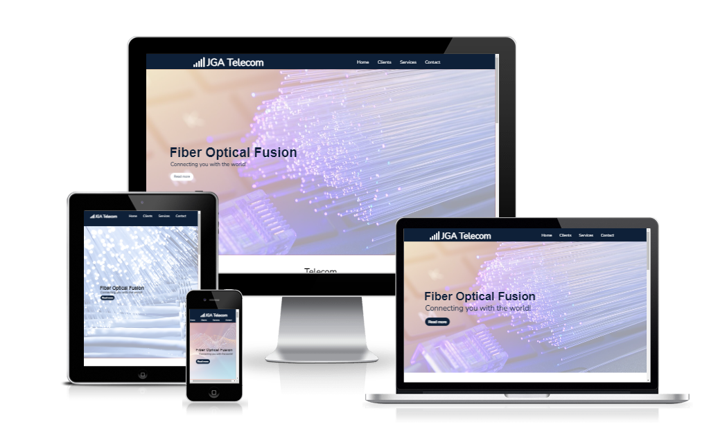

<h1>JGA TELECOM</h1>

<h2>Features</h2>
<h3>Existing Features</h3>
    <ul>
        <li>Navigation Bar</li>
    <ul>
    <li>It presents the 4 pages of navigation through the website, all are responsive.</li>
    </ul>
    </ul>

<ul>
<li>Request information button</li>
    <ul>
    <li>Responsive button to request information.</li>
    <li>Our navigation bar has a hidden screen with a return message to the company's request for information, guaranteeing the customer that the company will receive it.</li>
    </ul>
</ul>

 

<ul>
 <li>Landing Page</li>
    <ul>
    <li></li>
    <li></li>
    </ul>
</ul>
<ul>

<ul>
<li>Footer</li>
    <ul>
    <li>In the footer there are navigation buttons for the pages and also for returning to the top.</li>
    <li>A link to subscribe to the company's channel, with the benefit of receiving Internet tips, news from the fiber optic market and a catalog of services from our partners by email.</li>
    <li>It has access buttons to all the company's social media.</li>
    <li>The subscribe button also has a hidden thank you screen</li>
    </ul>
</ul>

 <li>Clients Page</li>
    <ul>
    <li>It has a list of the company's customers and partners.</li>
    <li>All have their logo and responsive link that leads to the company's website.</li>
    </ul>
</ul>

<ul>
 <li>Services Page</li>
    <ul>
    <li>List of services provided by JGA Telecom.</li>
    <li>Images to demonstrate the quality of service provided to customers.</li>
    </ul>
</ul>

<ul>
 <li>Contact-Us Page</li>
    <ul>
    <li>Responsive form, with return message.</li>
    <li></li>
    </ul>
</ul>

<h2>Design</h2>
<ul>
 <li>Colours</li>
    <ul>
    <li>To define the color palette, I opted for contrasting ones and also used color psychology: orange is defined as an energetic and vibrant color, while blue is associated with reliability, competence, quality.</li>
    <li></li>
    </ul>
</ul>

<ul>
 <li>Fonts</li>
    <ul>
    <li></li>
    <li></li>
    </ul>
</ul>

<h2>Features left to implement</h2>

<h2>Technologies Used</h2>
<ul>
 <li>Balsamiq</li>
    <ul>
    <li></li>
    </ul>
</ul>

<ul>
 <li>HTML</li>
    <ul>
    <li></li>
    </ul>
</ul>

<ul>
 <li>CSS</li>
    <ul>
    <li></li>
    </ul>
</ul>

<ul>
 <li>Gitpod</li>
    <ul>
    <li></li>
    </ul>
</ul>

<ul>
<li>GitHub</li>
    <ul>
    <li></li>
    </ul>
</ul>

<ul>
 <li>Google Developer Tools</li>
    <ul>
    <li></li>
    </ul>
</ul>

<h2>Testing</h2>
<ul>
<li>W3C Markup Validator</li>
    <ul>
    <li></li>
    </ul>
</ul>

<ul>
 <li>W3C CSS Validator (Jigsaw)</li>
    <ul>
    <li></li>
    </ul>

</ul>
<ul>
 <li>Lighthouse (Chrome Developer Tools)</li>
    <ul>
    <li></li>
    </ul>
</ul>

<h3>Further Testing</h3>

<h2>Bugs and fixes</h2>

<h2>Deployment</h2>
<h3>GitHub</h3>

<h4>Deploying a GitHub repository via GitHub Pages</h4>
<ol>
<li></li>
<li></li>
</ol>
<h4>Cloning the GitHub Repository</h4>
<ol>
<li>On GitHub.com, navigate to the main page of the repository.</li>
<li>To clone your repository using the command line using HTTPS, under "Quick setup", click in copying.  To clone the repository using an SSH key, including a certificate issued by your organization's SSH certificate authority, click SSH, then click in copying.</li>
<li>Open Git Bash.</li>
<li>Change the current working directory to the location where you want the cloned directory.</li>
<li>Type git clone, and then paste the URL you copied earlier.</li>
<li>Press Enter to create your local clone.</li>
</ol>

<h2>Credits</h2>
<ul>
 <li>css-tricks.com/</li>
    <ul>
    <li>Used to help in learning and defining Flex-box and Grid.</li>
    </ul>
</ul>
<ul>
 <li>Slack</li>
    <ul>
    <li>Used to understand the use of some tools.</li>
    </ul>
</ul>
<ul>
 <li>Kevin Powell (Youtube channel)</li>
    <ul>
    <li>For more information on smart grid and flexbox choices.</li>
    </ul>
</ul>
<ul>
 <li>Docs.github.com</li>
    <ul>
    <li>Paths for GitHub.</li>
    </ul>
</ul>
<ul>
 <li>formsubmit.co/</li>
    <ul>
    <li>Form terminal that sends the entries to our email.</li>
    </ul>
</ul>

<h2>Content</h2>
<ul>
 <li></li>
</ul>

<h2>Media</h2>
<ul>
 <li>Images</li>
 <ul>
 <li>Pexels.com</li>
 <li>Unsplash.com</li>
 <li>istockphoto.com</li>
 </ul>
</ul>
<ul>
 <li>Icons</li>
 <ul>
 <li>fontawesome.com</li>
 <li>pngegg.com</li>
 </ul>
</ul>
 <li>Colors</li>
 <ul>
 <li>fabmood.com</li>
  </ul>
</ul>

<h2>Summary</h2>

